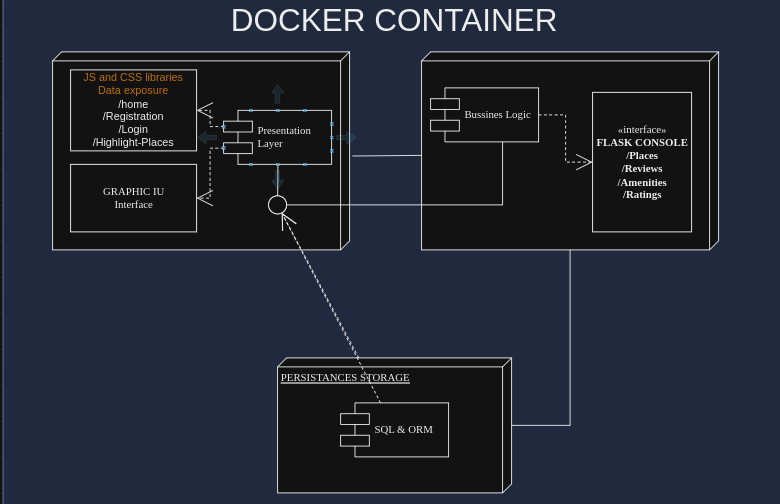

# This is the Air-BnB Holberton project (HBNB)
This project has the following objectives to my learning journey
* Learn to design backend software operations
* Get familiar with modeling data entities and processes using tools
* Developing bussiness logic
* Building operation structure coherience
* Testing
* Deployment using docker

# How is planned to be made?
The simplest in modern web programming is to provide a service which can be accessed throught a secure protocol such as HTTPS
and the project propused a web application that will handle all the operations regarding to managing rooms, places and spots around the world and is connected to a database to be persistent at the time when the user wants to make a request about such item, then expose the service throught a graphical interface
## High-level package diagram

### Another example

In the following diagram we can see how class entities are create and relate to each other
## Class Diagram 
[](https://mermaid.live/edit#pako:eNp9VE1v4yAQ_SuIU5rGOe3Jh0pdteqHdlerjXKzZM3CNKGxwQKcKEr73zv4q9C09Yl5M_DeDM-cuDASec5FBc7dKNhYqFmhu5D9BIe_KV-xU6EZfZfO25yt1w83PwagLJVWvixnc7Abt2Dz-e4QVhfjBtjj7GIqpv1UO8belFIJH-LXQo-sa4d2IlwFwj9QYxzf1qCqHsga2nIwVg75R2d0zq6lLMMxE1MIckadTHBE-LcCgWmLXnlfYYxIdMKqxiujY7ixSiR1FdDeViaQ0ZsI-6WcJ4k10uAUugEFktwEIbNPRxekT-lI-z_cKzyk4lft_2cU_nv1_USiyUrw6NUUhhFa3CcC4jhRF1rqst0oU4V9o8dUYsT7hb7AD_3WRMNH7FzHQJhqebdylnUOK3Tnsyx7uWJ3LTrPcvagt2iVBx2u9D19b86zvWeybMpeO2eEgr6Dsefl8qp3V6GHi1ouXyZonFBHf0rcQdXlllbGHge8hh3SiEnUviP54IOgIj3CHDQOljr3WPjtvrYWX_AaLf1kkl6G7tSC-y3SlfGclhLsruBUS3XQerM6asFzb1tccGvazZbnT1A5itomuGp4VvqS1zdgDXNw)

## Sequence diagram

